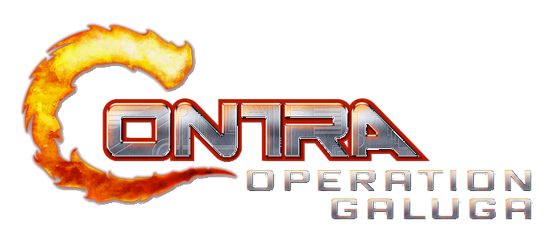
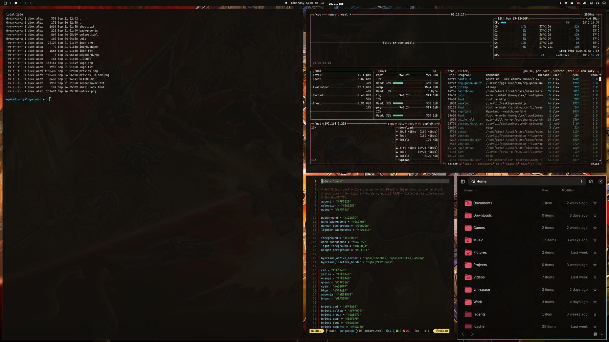
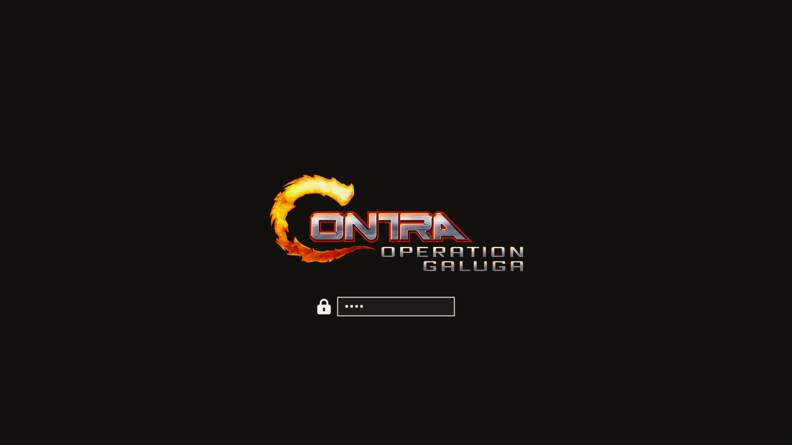

# Operation Galuga — Omarchy theme

Remember the code? The “broken” yet fun playthroughs with all those
unlockable characters? The Spread Gun? What if your desktop could match that
fiery palette — you should be good at mashing that fire button; Hypr makes
you go fast anyway. Jungle black. Muzzle-flash orange. Laser cyan on the
borders. Hard Corps chrome, Red Falcon heat, no HUD clutter on the carousel.
Hyprland’s active border runs the same dual-accent trick as the asphalt
night pack and the HEV suit: **Contra fire → laser cyan** at 45°.

Run-’n’-gun theme for [Omarchy](https://omarchy.org/). Inspired by the look of
*Contra: Operation Galuga* — **not affiliated with Konami or WayForward**
(see [Credits](#credits--legal-ish) below).

No existing Omarchy (or portable Linux desktop) pack turned up for this title —
HyperSpin frontend themes exist elsewhere, but they don’t port. This one was
built from Steam library / promo art the same way as
[Asphalt Legends](https://github.com/AlxWolfenstein97/omarchy-asphalt-legends-theme)
and
[HEV Suit](https://github.com/AlxWolfenstein97/omarchy-hev-suit-theme).

<p align="center">
  
</p>





## Install

```bash
omarchy theme install https://github.com/AlxWolfenstein97/omarchy-operation-galuga-theme.git
# optional — About + screensaver ASCII for this theme (skippable; see Branding)
cp ~/.config/omarchy/themes/operation-galuga/about.txt ~/.config/omarchy/branding/about.txt
cp ~/.config/omarchy/themes/operation-galuga/screensaver.txt ~/.config/omarchy/branding/screensaver.txt
```

That clones **and** applies the theme (`omarchy-theme-set` runs inside
`theme install`). Do **not** follow with another `omarchy theme set` — a second
set skips the first wallpaper and just wastes a switch.

Or clone into place (then you *do* need an explicit set):

```bash
git clone https://github.com/AlxWolfenstein97/omarchy-operation-galuga-theme.git ~/.config/omarchy/themes/operation-galuga
omarchy theme set "Operation Galuga"
# optional branding — same as above
cp ~/.config/omarchy/themes/operation-galuga/about.txt ~/.config/omarchy/branding/about.txt
cp ~/.config/omarchy/themes/operation-galuga/screensaver.txt ~/.config/omarchy/branding/screensaver.txt
```

Already installed and just switching back later:

```bash
omarchy theme set "Operation Galuga"
# optional — re-apply this theme’s About / screensaver marks
cp ~/.config/omarchy/themes/operation-galuga/about.txt ~/.config/omarchy/branding/about.txt
cp ~/.config/omarchy/themes/operation-galuga/screensaver.txt ~/.config/omarchy/branding/screensaver.txt
```

Cycle wallpapers with `omarchy theme bg next`.

## What’s in the pack

| Asset | Role |
|-------|------|
| `colors.toml` | Palette (the real theme) |
| `backgrounds/` | HUD-less / logo-free wallpapers |
| `unlock.png` / `preview-unlock.png` | Plymouth unlock + picker mockup |
| `preview.png` | Theme switcher preview |
| `icon.txt` / `logo.txt` (+ `about.txt` / `screensaver.txt`) | About & screensaver **ASCII** branding |
| `icon.png` / `logo.png` | Same marks as images (README + optional “Set From Image”) |

### Branding (About / screensaver)

**Optional.** Omarchy’s About screen and screensaver read from
`~/.config/omarchy/branding/`. Shipping per-theme `.txt` marks isn’t original —
other Omarchy 3.x themes did it — but it’s the fast path if you want *this*
pack’s wordmark on idle and on About without hunting files.

**Prefer the `.txt` files** and the `cp` lines in [Install](#install). That’s
what you’re meant to see. Editing the text also works (Style → About /
Screensaver → Edit Text).

**Skip the `cp` if you already have custom logos / screensaver art you care
about** — or back those up first. The branding slot is really meant for *your*
marks (put personal art somewhere easy to reach). The Style file picker works,
but drilling into `~/.config/omarchy/themes/...` is slow busywork for something
optional. Don’t feel obliged to bring mine.

The `.png` versions are here for the README and for a quick Style → **Set From
Image** try. In my experience Omarchy’s image→ASCII path is a bit thinicky on
color and boxing, so don’t expect magic from the PNGs — the hand text is the
good path.

Screensaver / logo ASCII has **no empty lines** (dense pack, same rule as the
other game themes when the art set allows it).

### Unlock

Style → Unlock → pick this theme (`unlock.png` / `preview-unlock.png`).

## Extend further with plugins

This repo is **palette + assets** on purpose. Omarchy already colour-coordinates
the shell, terminals, and editor from `colors.toml`. The plugins below push that
idea as far as it can reasonably go — optional extenders, not required theme
baggage. Themes keep working without them; authors can stick to the snappier
stock pipeline if they prefer.

They do **not** depend on each other. Pick what you want; run the whole
inch-a-lada if you want the desktop to feel like yours.

### The big sweep

- **[Chroma](https://github.com/AlxWolfenstein97/chroma)** — GTK3 / GTK4 /
  libadwaita + Qt in one hook:  
  `omarchy plugin add https://github.com/AlxWolfenstein97/chroma.git --enable`  
  (Then arm theme-set — see **Not broken — one more step** below, or Chroma’s
  **Marketplace consent** on GitHub.)

### One-surface Style plugins (palette previews + apply)

| Plugin | What it themes |
|--------|----------------|
| **[OmaOBS](https://github.com/AlxWolfenstein97/omaobs)** | OBS Studio (real Yami `Omarchy.ovt`) |
| **[OmaCursor](https://github.com/AlxWolfenstein97/omacursor)** | Pointer / Adwaita XCursor recolor (+ optional SDDM) |
| **[OmaHud](https://github.com/AlxWolfenstein97/omahud)** | MangoHud colours only — live in-game retint |
| **[OmaBoot](https://github.com/AlxWolfenstein97/omaboot)** | Limine boot menu colours |
| **[OmaVT](https://github.com/AlxWolfenstein97/omavt)** | Virtual console / TTY palette |
| **[OmaTTY](https://github.com/AlxWolfenstein97/omatty)** | Console font (Terminus-first, accessibility) |

```bash
omarchy plugin add https://github.com/AlxWolfenstein97/omaobs.git --enable
omarchy plugin add https://github.com/AlxWolfenstein97/omacursor.git --enable
omarchy plugin add https://github.com/AlxWolfenstein97/omahud.git --enable
omarchy plugin add https://github.com/AlxWolfenstein97/omaboot.git --enable
omarchy plugin add https://github.com/AlxWolfenstein97/omavt.git --enable
omarchy plugin add https://github.com/AlxWolfenstein97/omatty.git --enable
```

**Not broken — one more step.** `plugin add --enable` only drops code + starts
the quiet service (restores already-armed wiring — no Style consent yet).
Workshop piece-meal is one paste per plugin (`add` + `install.sh`, asks [Y/n]).
Boom-in: add the ones you want, then arm-all once (deps + Style/theme-set +
root/SDDM/DRM, skips Y/n — optional shortcut, interactive still exists).

```bash
# Example piece-meal (one plugin):
omarchy plugin add https://github.com/AlxWolfenstein97/omacursor.git --enable
~/.config/omarchy/plugins/io.github.alxwolfenstein97.omacursor/install.sh

# True one-shot IN for whatever you already `plugin add`’d:
~/.config/omarchy/plugins/io.github.alxwolfenstein97.chroma/tools/arm-all-family.sh
```

(Chroma alone: same family script, or
`~/.config/omarchy/plugins/io.github.alxwolfenstein97.chroma/install.sh --yes --with-root`.)

**Full wipe — one shot out.** Mirror of arm-all: teardown + inline Limine/VT/
FONT/chroma-root resets (no floater Y/n) + best-effort `omarchy pkg drop` for
what we brought + `plugin remove`. If something else still needs a package,
pacman keeps it — fine. Interactive per-plugin uninstall.sh prompts in that terminal (no floaters); `--yes` / wipe-all skip the Y/n.

```bash
~/.config/omarchy/plugins/io.github.alxwolfenstein97.chroma/tools/wipe-all-family.sh
```

Single plugin (same `--yes` behaviour as wipe-all uses under the hood):

```bash
~/.config/omarchy/plugins/io.github.alxwolfenstein97.chroma/uninstall.sh --yes
~/.config/omarchy/plugins/io.github.alxwolfenstein97.omacursor/uninstall.sh --yes
# …same path pattern for omaobs / omahud / omaboot / omavt / omatty
```

(Privileged steps may still ask for a password once — that’s the boom, not a prompt menu.)

### Already solved elsewhere (gladly)

- **[Omacord](https://github.com/ASwenia/omacord)** — Vesktop / Vencord Discord
  follows Omarchy themes live:  
  `omarchy plugin add https://github.com/ASwenia/omacord --enable`

### Agent / desktop bridge

- **[OMCP](https://github.com/btsouth/omarchy-omcp)** — MCP desktop bridge:  
  `omarchy plugin add https://github.com/btsouth/omarchy-omcp --enable`

Browse more on the [Omarchy Plugins](https://plugins.omarchy.org/) site.

## Taste

Colours and contrast are tuned for what I like to look at. If they feel loud or
wrong for you, fork and retune `colors.toml` without guilt.

## Credits / legal-ish

- Visual inspiration and reference art from **Konami** / **WayForward**’s
  *Contra: Operation Galuga* branding and marketing (including Steam library
  hero / logo assets). **Not affiliated with, endorsed by, or sponsored by
  Konami or WayForward.** Just public pixels arranged into an Omarchy theme —
  no money, no official product.
- If Konami or WayForward hates this existing, they can say so and I’ll deal
  with the repo accordingly.

## License

Do whatever you want with this theme pack unless Konami, WayForward (or the
law) says otherwise. Fork it, recolor it, ship it in a rice. No warranty —
it’s wallpaper and hex codes.
